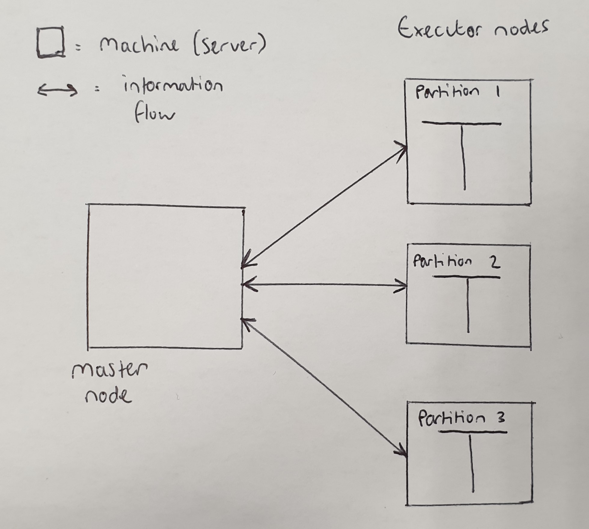
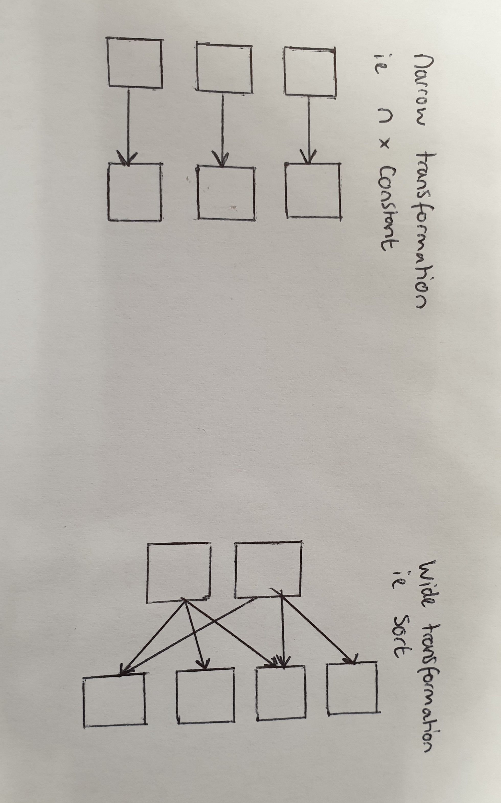
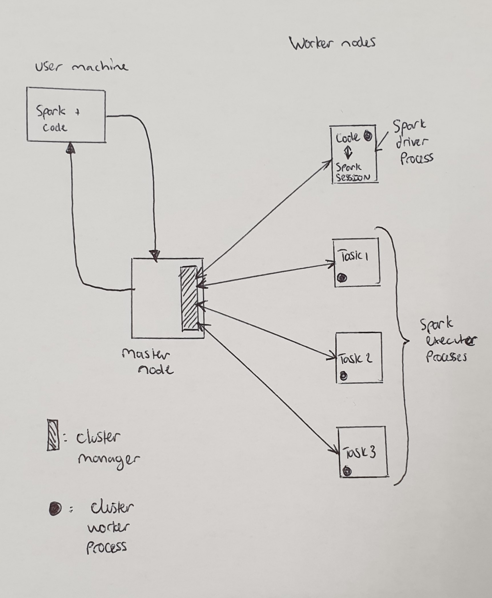

This post has mainly been writen for me, so that in the future I have a general reference guide for spark and so I dont have to piece together the various bits I've found strewn across the internet in order to build an EMR instance that I like. Also I originally wanted to build this to test whether reticulate could be used to link in with Spark on an EMR (elastic map reduce) cluster.

## Part 1: A quick introduction to spark

### What is spark?

Spark is a computing engine designed for large scale data computation, ie focussed on cleaning and analysing and not storage. It was developed at UC Berkley and then donated to the Apache Software Federation, where it is maintained on an open source basis.

### How does it work?

Spark works through a number of servers joined together in a cluster, with one server acting as the master node in order to control the cluster and the others acting as executor nodes to distribute the data across (known as partitions) and perform actions, as shown below. 

{ width=50% }

These actions are evaluated lazily, meaning that operations are not carried out until an action is required. For example multiplying a column will not occur until acount is required of the output. This strategy allows spark to calculate and optimise a plan in which to run the operations acros sthe cluster, increasing speed. 

In addition to being performed lazily, transformations can either be narrow or wide, which is explained below and also shown on the below digram.

* Narrow transformation - Data in each partition can only be data in one partition, for example mutliplying a column of numbers by a constant

* Wide transformation - Data in each partition can become data in multiple other partitions, for example sorting a partition.

The latter of these two is known as a shuffle, as it moves around the partitions, and involves writing the data to disk, where as narrow transformations are performed in memory, leading to differences in speed.

{ width=50% }

### How is a cluster operated?

The majority of times a cluster will be operated via what is refered to as structured API, which acts as a bridge between a more common programming language and the native spark language. Currently these are available for scala, java, python SQL and R, where code written in these languages is translated within a spark session. A summation of the process is shown below, which involves a user propositioning the cluster manager, on the master node, for resources, leading to the creation of a spark driver process which includes the user code and a spark session. Once the full plan is determined, via the spark session, it is communicated to the cluster manager, which then allocates resources to run each process. The results of these processes are then fed back to the master node.

{ width=50% }

## Part 2: Setting up an AWS EMR


### Step 1 - setting up the EMR cluster

The first step is finding your was to the emr homepage within AWS, which looks like below, where you can initiate a cluster from.

{ width=50% }

By clicking on create a cluster youll find yourself being able to select your cluster options, including the name and software etc, choose spark and pick your key pair and you're good to launch.

{ width=50% }

Once you've launched you can then set the security options, though only the first time you launch, these can be found on your cluster page post launch. Here you need to edit the inbound rules on both the master and slave nodes al open port 22 for your IP, via SSH, and a custom TCP for port 8787 which is open to all ips for rstudio server.

{ width=50% }
 
Once you've waitign the 10 or so minutes for the cluster to gear up you can ssh in, with from the terminal or putty, if you're on windows. This requires some of the details within the ssh box that you can expand from your clusters page, shown below.

{ width=50% }

Once you're in you need to add the passcode you applied to your keypair and then you should see the friendly screen below!

{ width=50% }


### Step 2 - Updating the EMR with required software

Now that we have our servers up and running and we've ssh'd into the main node it's time to update our software. For me this involves changing our default python to python 3, installing RStudio server and setting teh park python path to use the anaconda version I want to call through reticulate..


I found it best to first install rstudio server, using the following code, taking the file path from https://www.rstudio.com/products/rstudio/download-server/ and selecting the CentOS tab. At the same time we might as well create the user for said programme using the following code and open the ssh connection so that we can access it through the browser. The reason I do this first is it alters your path file and so would reset the anaconda path you set later on.
```{}

wget https://download2.rstudio.org/server/centos6/x86_64/rstudio-server-rhel-1.2.1335-x86_64.rpm

yes | sudo yum install rstudio-server-rhel-1.2.1335-x86_64.rpm

sudo su
sudo useradd <username>
sudo echo <username>:<password> | chpasswd

```


Now we need to change the python path to python 3 and install some packages. I found the best way to do this was to add a python alias.
```{}

alias python="/usr/bin/python3.6"

which python

sudo su

python3.6 -m pip install --upgrade pip

python3.6 -m pip install pandas

```


Now that we have the anaconda version set up as default we can change the spark version, which is pretty easy going, just requiring the following code, which alters the path in the spark config. Use the second command to check and the third to return back to the cluster home.
```{}

sudo sed -i -e '$a\export PYSPARK_PYTHON=/usr/bin/python3.6' /etc/spark/conf/spark-env.sh

pyspark

exit()

```

### Step 3 - Rstudio server

Now the infrastructure is all set up its time to open rstudio and login. This is done by copying in your ip address to your browser and adding :8787, to access Rstudio server, and then entering your username and password from before.

The next step is to load / update some neccesary packages, done with the following code. These installations will take some time due to the compiled C++ code associated with dplyr. Following this we add a system variable to point to the correct python version.
```{r, eval=FALSE, echo=FALSE}

install.packages(c("reticulate", "readr", "dpylr", "rmarkdown", "rprojroot", "png"))

Sys.setenv(RETICULATE_PYTHON = "/usr/bin/python3.6")

```

Now lets load the packages we need and set our python version
```{r, eval=FALSE, echo=FALSE}

library(reticulate)
library(dplyr)

use_python("/usr/bin/python3.6", required = T)

```


